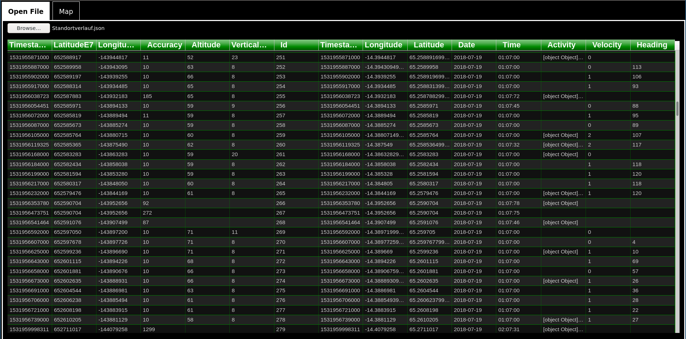
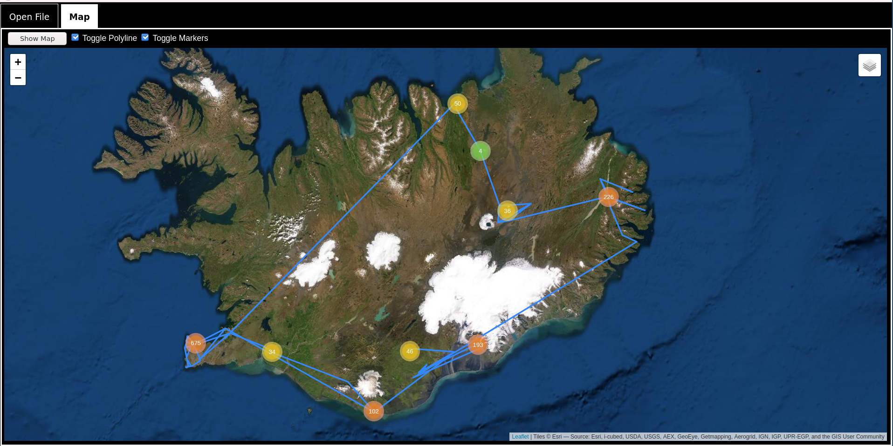

# GooglePath

GooglePath is a completly client sided single file webpage/program to view the location data google collects. You only need a standart browser to view this data as a grid of waypoints as well as on a map as a polyline or as marker clusters.

## Impressions/Screenshots

## Installation and retriving your data

No installation is needed. The file googlepath.html can be viewed in every standart browser.

To retrive your own personal location data from google you might want to do a [Google Takeout](https://takeout.google.com/https://takeout.google.com). For testing purposes I provided a example file that you might use instead but for privacy reasons it is not that large and won't show you the ability of this repository to easily display even millions of data points.

## Usage

1. Just open the file googlepath.html in a browser of your choice (text based browser not supported ;-) )
2. Klick on "Browse" button to open the JSON file google send you (or the example file in the example directory
3. Wait a short moment until your data is parsed (depending on how muc hdata google collected about your location (tested up to a few hundred MB)
4. Once the data is loaded a grid with a tabular form of the data should appear
5. Change the tab to "Map" and click on the "Show Map" button to initialise the map (leaflet actually doasn't like it to be initiated in hidden tabs)
6. Toggle the polyline and marker Checkboxes to show your location data as a polyline or as marker clusters on the map
7. Enjoy,  and take your time browse your own data (and remember places you once have benn and just forgot about them ;-) )

## About this software

Since the google timeline function only allows you to view one day at a time (and because of curiosity) this program came to be. This software:

- is a one file program that gets all external software from CDN's
- is purely client sided (so your data stays on YOUR computer only)
- uses Slickgrid to be able to show millions of rows in a normal browser
- uses leaflet to show the map
- uses leaflet.markercluster to show markerclusters
